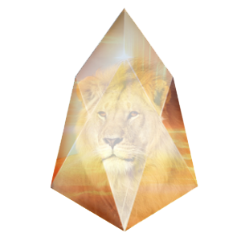

---

## About me

### 愿景
本站主要有以下3个愿景。
* 分享区块链哲学，推广区块链应用，促进区块链行业发展；
* 分享区块链热门技术，解读专业术语，以及相关技术外文翻译；
* 分享区块链开发实践。

### 板块
根据上面的愿景，本站主要分为3个大板块。
* 区块链哲学
* 区块链应用推广
* 区块链开发

### 免责申明
* 本站的内容均为作者收录或编写，仅代表个人理解，具体以官方文件为准；
* 本站收录或转载的内容，均会取得作者授权，如有未注明出处或禁止转载，请联系本站作者。

## Contact author

* GitHub：[wuxy](https://github.com/wuxyBlockChain)
* email：wuxy_od@163.com
* [知乎](https://www.zhihu.com/people/wu-xin-you-78)

## Update Log

* 2018.11.15 本站建立完成。

## 友情链接

[羡辙杂俎](http://zhangwenli.com/blog) \| [Anotherhome](https://www.anotherhome.net) \| [Reverland](http://reverland.org/) \| [ZhiLi](http://lizhipower.github.io/) \| [Simmer](http://simmer-jun.github.io/) \| [awthink](http://awthink.net/) \| [Aralic](http://aralic.github.io/) \| [zchen9](http://www.chen9.info/) \| [wuhuaji](http://wuhuaji.me/) \| [lisheng](http://www.lishengcn.cn/) \| [薛彬XueBin](http://axuebin.com/blog/) \| [TBOOX](http://www.tboox.org/cn/) \|  [Ling](http://linglinyp.com/)

## Comments


